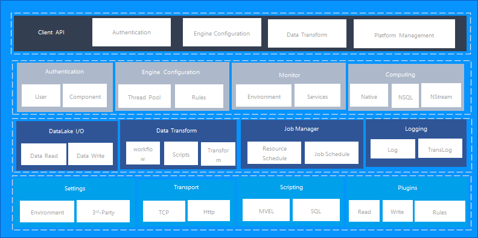

# Elasticlake

## An opensource Data Lake Engine

Elasticlake is an open source, distribute data lake engine build on top of [apache iceberg](https://github.com/apache/iceberg); it was designed to provide high performance data read and write capabilities, you can use elasticlake to store, query,build and manage data, you can also use elasticlake in real-time/offline data warehouse construction scenarios.

## Features:

* Distributed and Highly Available:

  * Fast lake data read and write ability. 

* Multi Tenant 

* Various set of APIs

* Document oriented

* Near Real Time Data Persistency

* Built on top of Iceberg

* Various set of Plugins support(DBT、Storage、Computing Engine)
